# 1、前言

之前上线了移动端国际化翻译系统V1版本，其中有一些弊端，例如：

+ 1、项目仅能适用于Android和iOS项目，针对前端项目，Flutter项目，和后端项目无法支持
+ 2、之前的桌面程序需要搭建本地java环境才能运行，对没有相关经验的同学来说有点痛苦
+ 3、之前的翻译系统仅能支持中文和英文，无法满足日新月异下多语言翻译的场景
+ 4、一个账号仅仅能用于一个项目的翻译，无法满足公司中多项目的场景
+ ...

**那这套系统能解决的痛点是什么呢？**

这不废话么，当然是为了解决上面的问题。。。

**项目主页地址：https://cretinzp.com/pro-translate**

# 2、系统使用流程

## 2.1 使用步骤

### 2.1.1 注册账号

访问：https://cretinzp.com/pro-translate/#/login ，注册账号，注册成功后登录

### 2.1.2 新建项目

访问：https://cretinzp.com/pro-translate/#/translate/projects

点击新建项目：输入项目名称和项目描述，选择项目平台，平台目前支持如下：

+ Android
+ iOS
+ 后端PHP-laravel
+ 前端Vue-i18n
+ Flutter-i18n
+ ...

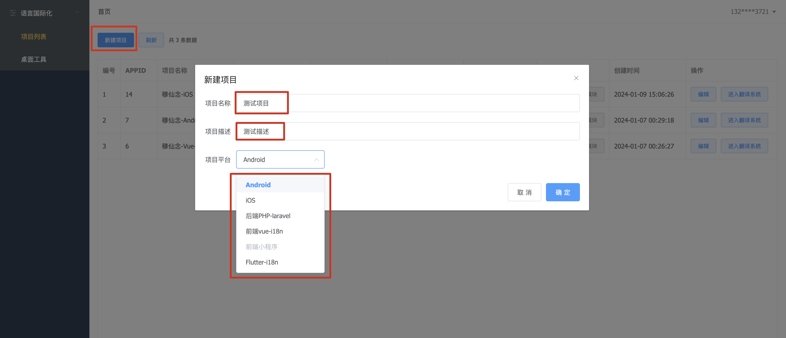

### 2.1.3 下载终端桌面程序

访问：https://cretinzp.com/pro-translate/#/translate/tools ，下载对应你当前设备的桌面程序

### 2.1.4 登录桌面端

访问：https://cretinzp.com/pro-translate/#/translate/projects ，点击右上角你的手机号，在弹出框中选择获取token，复制对话框中您的token信息。

打开您刚刚下载的桌面程序，在登录页面输入刚刚获取到的token信息，点击登录即可。

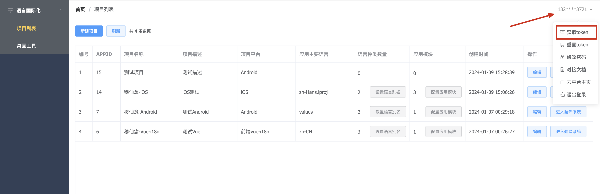

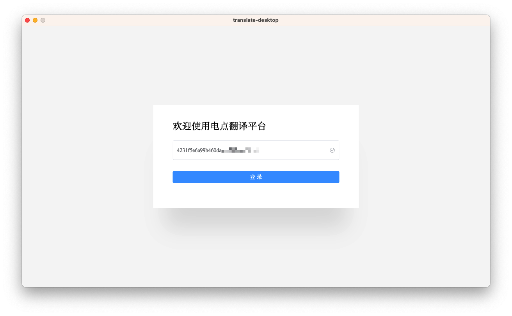

### 2.1.5 选择和配置项目

终端登录成功之后，点击首页的切换项目（首次登录会直接弹出切换项目弹窗），选择你刚刚创建的项目。

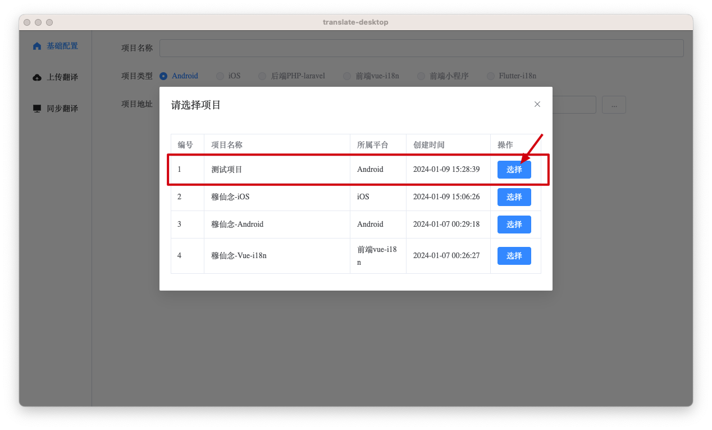

选择项目之后，请配置项目地址，如图所示，请注意，请务必选择项目根目录

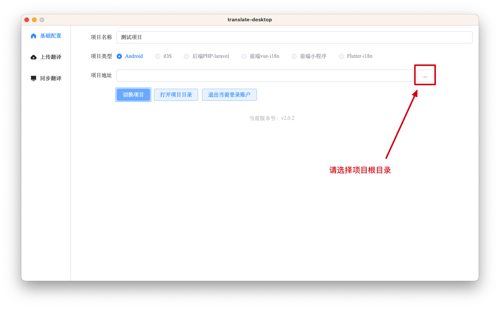

### 2.1.6 整理项目本身，确保项目中有需要翻译的内容

这里以Android为例：

我们新建一个Android项目，有两个module，一个是app，一个是mylibrary1，其中在两个module中分别在values中新建一个strings.xml文件，里面是用于国家化的配置信息，另外在app中在values的同级目录下新建一个values-en和values-ja文件夹，分别用于存放英文翻译和日语翻译，然后在里面分别新建一个空的strings.xml文件用于占位（这个是为了告知系统，我们需要适配哪几个国家的语言）。

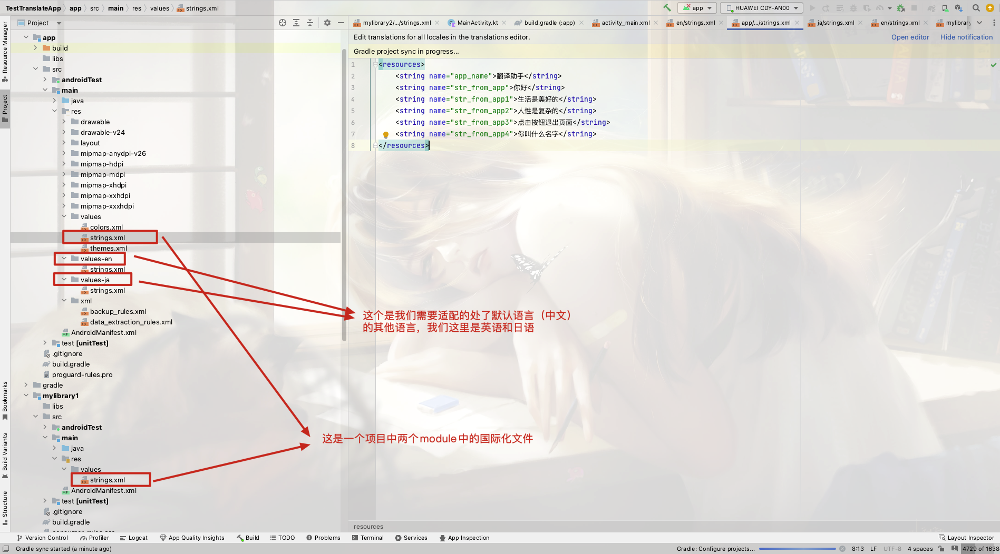

### 2.1.7 上传翻译

点击【上传翻译】，点击上方【拉取本地资源】，页面会展示拉去到的所有翻译内容，确认无误之后点击【上传数据到云端】

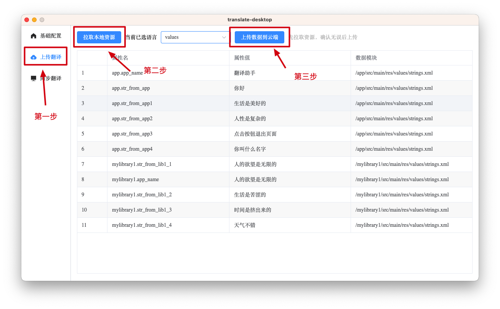

### 2.1.8 配置应用相关信息

访问：https://cretinzp.com/pro-translate/#/translate/projects , 选择你刚刚创建的项目，点击【设置语言别名】可给语言设置一个别名，方便查看

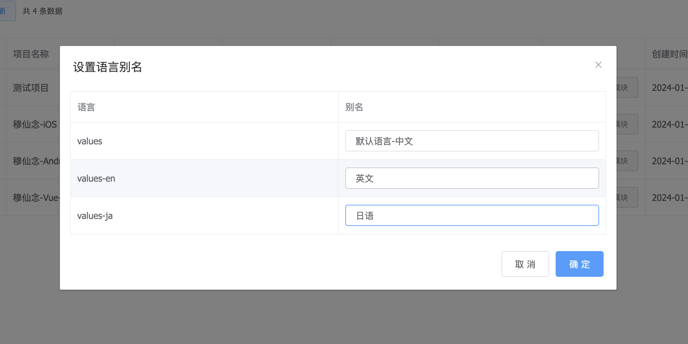

访问：https://cretinzp.com/pro-translate/#/translate/projects , 选择你刚刚创建的项目，点击【配置应用模块】可屏蔽不需要的模块数据，屏蔽之后该模块的数据将会被隐藏

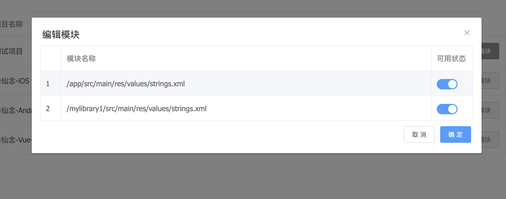

### 2.1.9 对内容进行翻译

访问：https://cretinzp.com/pro-translate/#/translate/projects ，选择你刚刚创建的项目，点击后面的进入翻译系统。

下面对整个页面进行简单的说明，整体说来，这个页面可以搜索指定内容，可筛选不同状态和语言类型，可导入和导出翻译内容，并对他国语言进行翻译。

点击待翻译区域的任意内容，可以打开翻译对话框，在这里会展示翻译原内容和被翻译的语言类型，底部还支持自动翻译，可支持大部分国家语言的互相翻译，翻译内容填充完成之后，点击确定即可保存翻译内容。

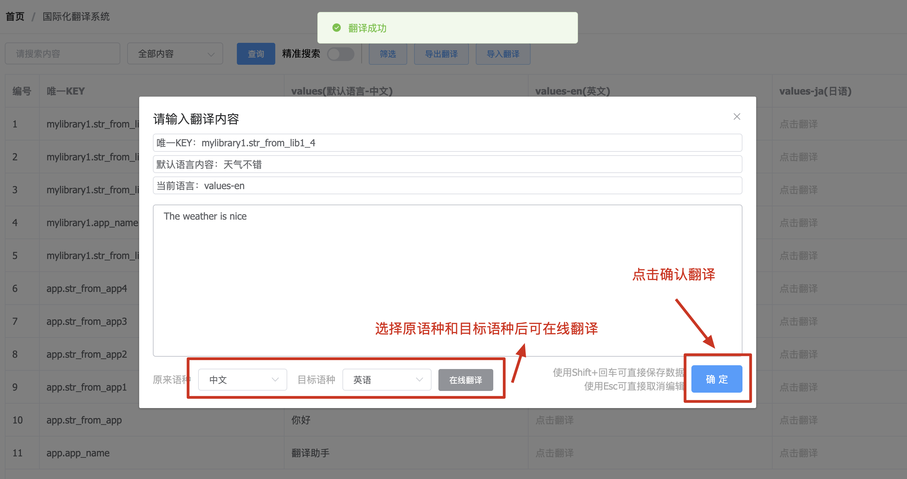

### 2.1.10 终端同步翻译到本地

首先在翻译系统中完成对内容的翻译工作，如图所示。

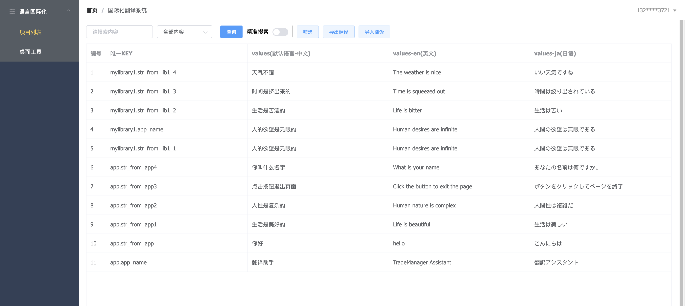

打开终端桌面程序，点击左侧【同步翻译】，点击上方【拉取云端数据】，确认无误后，点击【生成本地数据】

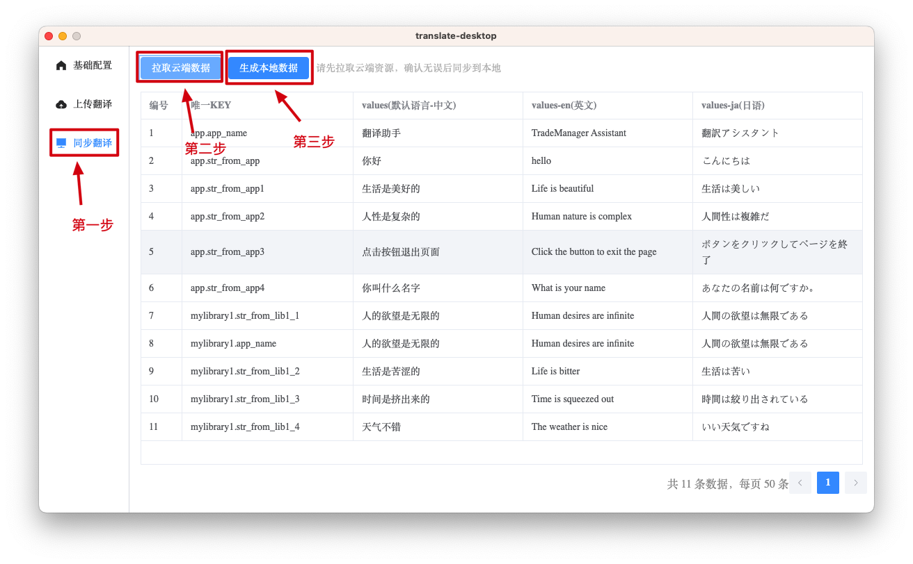

### 2.1.11 查看翻译效果

这里以Android为例：

查看本地项目中英文和日语文件夹下的strings.xml文件，可以看到，已经自动帮我们生成了对应的语言信息，至此，流程完结。

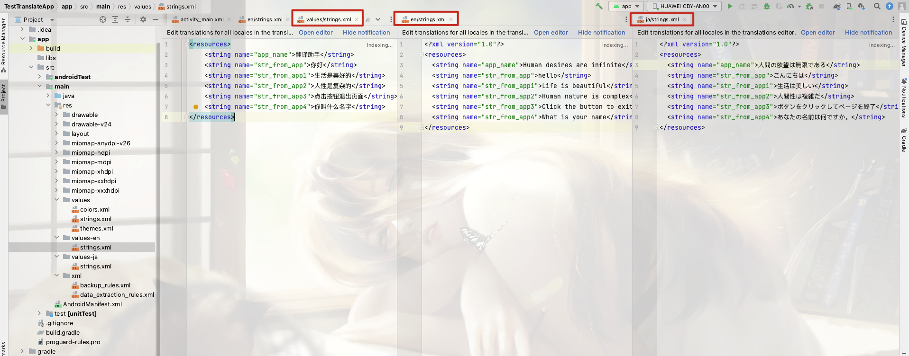

## 2.2 项目后续

项目目前支持的项目类型还是比较少的，所以如果你有项目需要用到这个系统但是这个系统并没有支持的时候，请尽快联系我，我会尽快适配你的项目类型，让这个系统更强大更好用。

我的联系方式：https://www.mxnzp.com  在这里能找到
